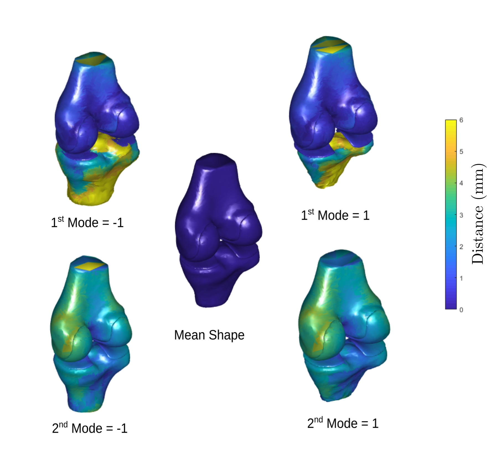

## Introduction

<!-- [](https_doi_link) -->

This project contains the source code related to the following publication:

TODO: Filip K. Zacharaki I. E., Moustakas K., "Regularized multi-structural shape
modeling of the knee complex based on deep functional maps".

> The incorporation of a-priori knowledge on the shape of anatomical structures
        and their variation through Statistical Shape Models (SSMs) has shown to
        be very effective in guiding highly uncertain image segmentation
        problems. In this paper, we construct multiple-structure SSMs of purely
        geometric nature, that describe the relationship between adjacent
        anatomical components through Canonical Correlation Analysis (CCA).
        Shape inference is then conducted based on a regularization term on the
        shape likelihood providing more reliable structure representations. A
        fundamental prerequisite for performing statistical shape analysis on a
        set of objects is the identification of corresponding points on their
        associated surfaces. We address the correspondence problem using the
        recently proposed Functional Maps framework, which is a generalization
        of point-to-point correspondence to manifolds. Additionally, we show
        that, by incorporating techniques from the deep learning theory into
        this framework, we can further enhance the ability of SSMs to better
        capture the shape variation in a given dataset. The efficiency of our
        approach is illustrated through the creation of 3D models of the human
        knee complex in two application scenarios: incomplete or noisy shape
        reconstruction and missing structure estimation.



## Requirements

* Matlab (tested in version 2018a)
* Meshlab: http://www.meshlab.net/
* Python 3.x
    - numpy - pip3 install numpy
    - nibabel - pip3 install nibabel
    - skimage - pip3 install scikit-image
    - stl - pip3 install numpy-stl
- Cpp libraries
    - flann (tested with v1.7.1; install binaries "http://www.pointclouds.org/downloads/windows.html")
    - eigen (tested with 3.3.7; header only "http://eigen.tuxfamily.org/index.php?title=Main_Page")

* Dataset: Osteoarthritis Initiative (OAI) https://nda.nih.gov/oai/
    - Labelmaps can be found here:
      https://opus4.kobv.de/opus4-zib/frontdoor/index/index/docId/6995

## Repository Overview
* `src` directory includes all source files used to reproduce the results
  presented in the publication. The main MATLAB files that constitute the
  pipeline are named `Step_X_<name>.m` located in `/src` directory. The source
  files for training and using of the neural network are located in
  `/src/deep_fm`. The rest of the sources and frameworks used are located in the
  `rc/utils` directory. Copyrights of that source code belong to the original
  authors where mentioned.
  
* `Data` directory includes images and annotations from the OAI dataset.

* `Results` is the target directory for saving the computed results of the
  pipeline. The only exception are data files that require pre-processing.
  `Results/train_knee_flags` includes the weights of the trained neural network.

## Instructions

* Run `mask_to_mesh.py` to create meshes (in .stl format) of the structures
  depicted in multi-label volumetric images (.nii.gz).

* Run `Step_1_MeshPreprocessing.m` to apply a series of filters to the created meshes.
  Processed meshes are saved separately in .off format.

* Run `Step_2_CulcInputs.m` to calculate the 1. geodesic distances of all the points
  for each mesh 2. Laplacian eigenfunctions 3. SHOT descriptors.

  Tip: To create the `calc_shot.mex` file run in MATLAB command window: 
  
  ```
  mex -v calc_shot.cpp shot_descriptor.cpp -DUSE_FLANN -I"<flann_install_dir>\include" -I"<eigen_install_dir>"
  ```

* Train the FMNet with `train_FMnet.py` and compute the functional maps using
  the `test_FMNet.py`. The computed matrices C (functional maps) for
  all shapes in the dataset are saved to './Results'. 

* Run `Step_3_ComputeShapeMatching.m` to compute point-to-point correspondences to
  reference shape based on either the Functional Maps framework or the standard
  ICP method.

* Run `Step_4_MultiOrganSSM.m` to create multi-structure Statistical Shape models
  including structure inter-correlation.

* Run `Step_5_ApplySSM.m`. Built SSMs are fitted to new shapes based on the shape
  regularization scheme. Full multi-structure shapes use the classic PDM model.
  Multi-shapes with missing structures use the SSMs based on CCA and conduct
  inference for the whole multi-shape.

* (opt) Run `shape_reconstruction.py` to refine the segmentation results based
  the fitted SSM model converted to multi-label mask.

## License
<a rel="license" href="http://creativecommons.org/licenses/by/4.0/"></a><br />This work is
licensed under a <a rel="license"
href="http://creativecommons.org/licenses/by/4.0/">Creative Commons Attribution
4.0 International License</a>.
